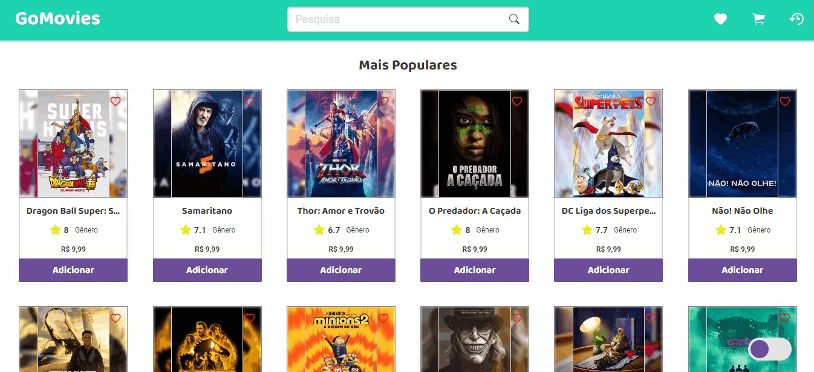

<h1 align="center">📽️ Go Movies 🎞️</h1>

 

<h3 align="center">Um site de venda de filmes, feito com React + Bibliotecas e que consome a <a href="https://developers.themoviedb.org/3/">The Movie DB API</a>.</h3>
<h3 align="center"><a href="https://go-movies.vercel.app/">Clique aqui para visitar o site!</a></h3>

---

<h2>Demonstração 🎥</h2>

_<h3>Um pequeno tour pelo Projeto 💻</h3>_

_<h3>Adicionando e removendo filmes do carrinho e favoritos 🛒</h3>_

_<h3>Completando Pedidos 📦</h3>_

_<h3>Pesquisando 🔎</h3>_

 

---

<h2>Funcionalidades! 🚀</h2>

 

- ✔️ O Website é `responsivo`
- ✔️ Possui `tema escuro`
- ✔️ Possui `auto complete da cidade e do UF` baseado no CEP
- ✔️ Possui uma página para ver `histórico de pedidos`
- ✔️ Possui `mensagens` para notificar o usuário
- ✔️ Possui `validação do formulário` em tempo real e máscara em inputs
- ✔️ Possui `lista de filmes favoritos`

 

---

<h2>Tecnologias Utilizadas 🛠</h2>

#### FrontEnd: `ReactJS!`

- Axios
- React Icons
- React Toastify
- React Hook Form
- Zod Resolver
- Typescript
- Context API
- Uuidv4
- Date-fns
- React Router Dom
- React Mask Input
- React Elastic Carousel

 
  
  
  
  
 

 

---

